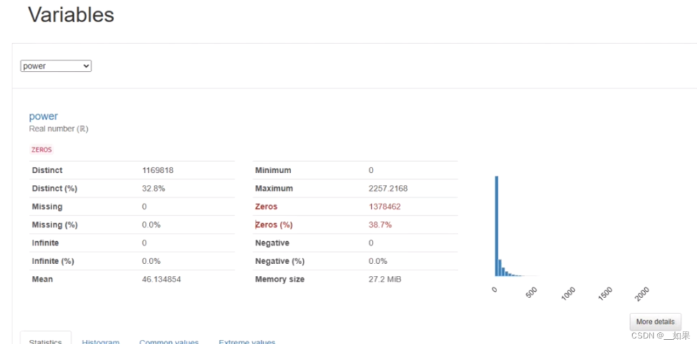
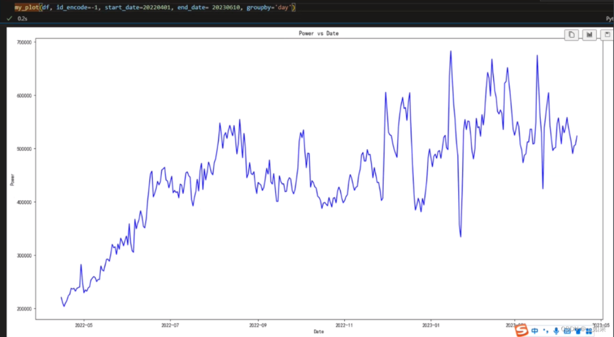
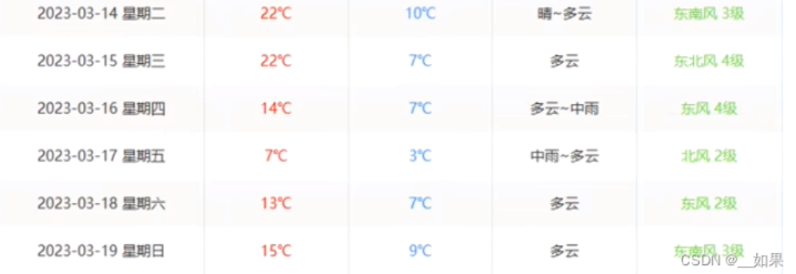
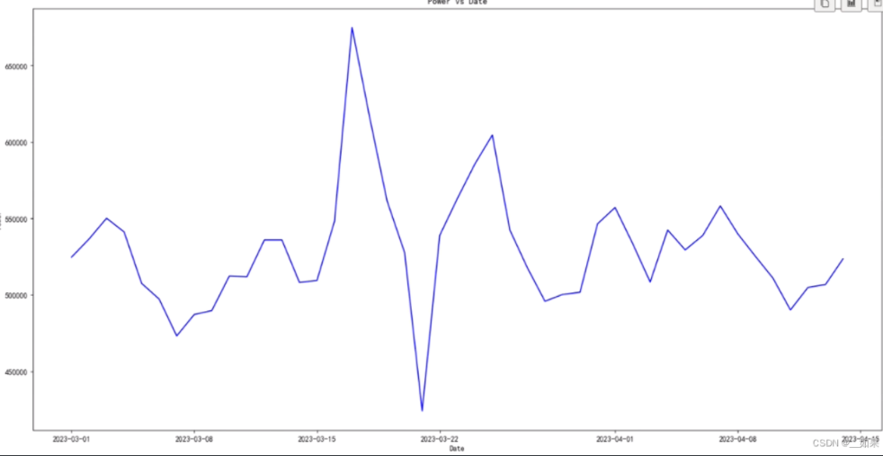
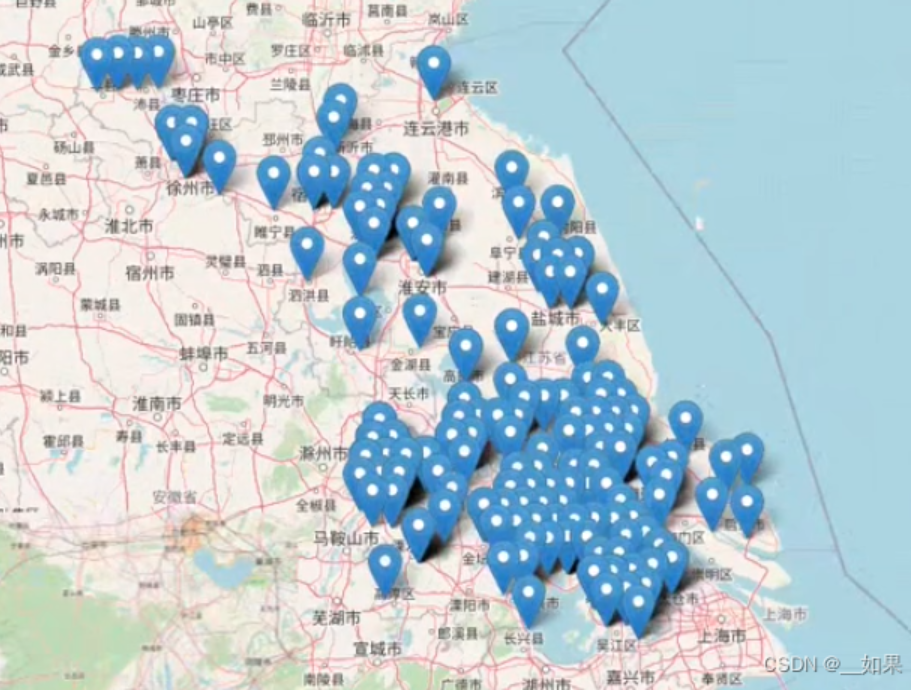
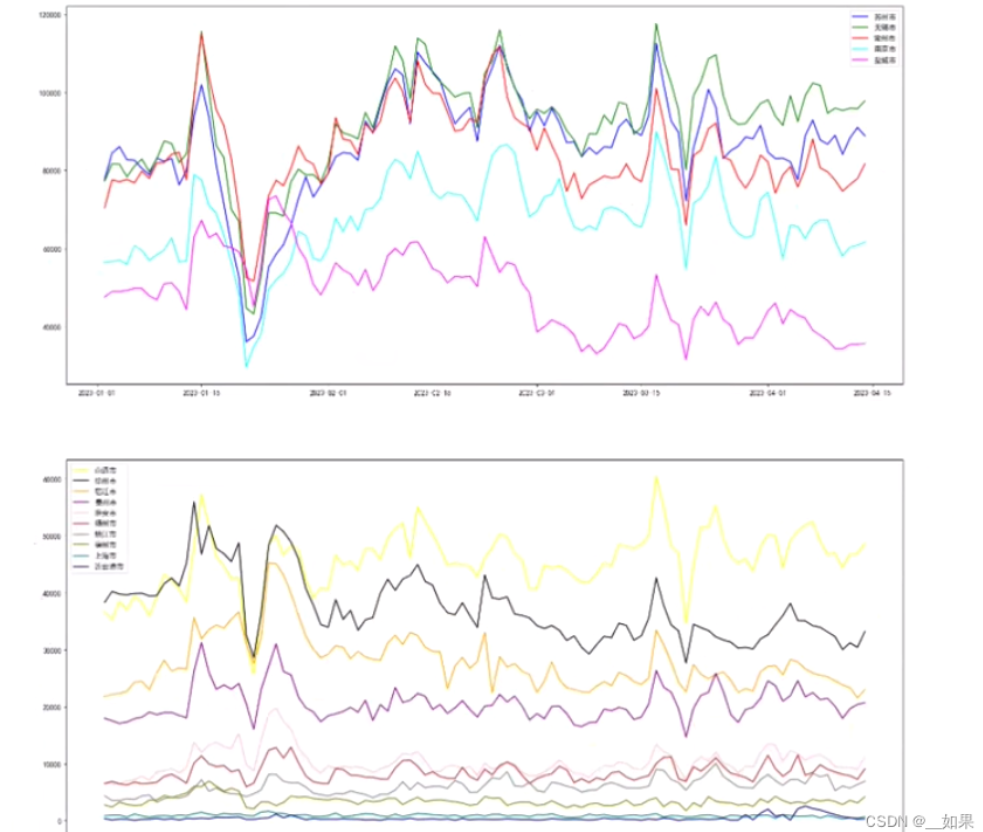

**感谢赵老师给我们带来的精彩分享！！！**下面是我听直播时随手做的笔记，内容很碎也有些没记到，还望各位多多包涵

一键式自动分析数据

对power进行分析

Q：为什么呈上升趋势？为什么会有这些突出来的点？

A：去年仍受疫情影响；1月低谷是因为过年

去年的数据对今年来说没什么参考价值

家用车可能都有自己的充电桩，所以可以往网约车这边考虑

3月17号有个峰值：寒潮，温度下降了十几度，电耗上升，充电效率下降

h3反映经纬度坐标

对经纬度进行切割，通过调用腾讯的接口得到城市信息

按照城市耗电量大小画图

在1月时，大城市会先下降，再缓慢恢复；小城市是1月上升，年后慢慢降低

节假日时大城市小城市的现象是相反的

df_stub与df_test_stub完全一样，可以直接删

选前十四天取均值补缺失值

例如328站点，绝大部分时间都是0，容易把有数据的点当作异常值点

**感悟：**

（1）学会利用外部数据去辅助分析，这往往会帮助我们更好地理解数据反映的现象

（2）赛题数据处理方法应依据实际情况而论，不能像套模板一样的往上套数据清洗的流程

（3）了解到一个好用的工具，之后可以体验看看